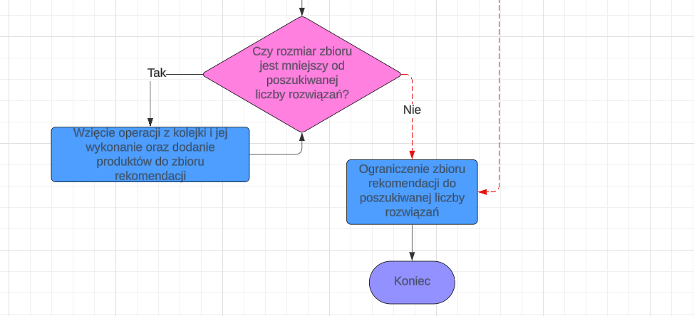

# **GenericShop**
An online store with dynamic product model and a product recommendation mechanism based on its features.

## 📜 License
This project is licensed under the [MIT License](LICENSE).

## 🛠️ Technologies Used
Depending on the project version, the versions of the technologies used may differ.

### 🌐 Frontend (React + Vite)
The frontend is a modern single-page application (SPA) developed with React and Vite for fast performance and efficient development.

#### Key Dependencies:
- **UI & Styling**: [MUI](https://mui.com/) (`@mui/material`, `@emotion/react`, `@emotion/styled`)
- **State Management & Forms**: `react-hook-form`, `zod`
- **Routing**: `react-router-dom`
- **Networking**: `axios`
- **Internationalization**: `i18next`, `react-i18next`
- **Authentication**: `jwt-decode`
- **Notifications**: `sonner`
- **Linting & Formatting**: `eslint`, `typescript`

### 🖥️ Backend (Spring Boot 3 + PostgreSQL)
The backend is developed with **Spring Boot**, ensuring scalability and maintainability while integrating with a **PostgreSQL** relational database.

#### Key Dependencies:
- **Spring Boot Framework**:
  - `spring-boot-starter-web` (REST API)
  - `spring-boot-starter-security` (Authentication & Authorization)
  - `spring-boot-starter-data-jpa` (ORM with Hibernate)
  - `spring-boot-starter-validation` (Data validation)
  - `spring-boot-starter-mail` (Email notifications)
  - `spring-boot-starter-thymeleaf` (Email server-side rendering)
- **Database & Persistence**:
  - `postgresql` (Database driver)
- **Authentication & Security**:
  - `jjwt-api`, `jjwt-impl`, `jjwt-jackson` (JWT authentication)
- **Testing & Development**:
  - `spring-boot-starter-test`, `testcontainers` (Integration testing)

### 🏗️ DevOps & Tooling
- **Build Tool**: Maven
- **Containerization**: Docker Compose support
- **Testing Frameworks**: JUnit, Testcontainers
- **Version Control**: Git & GitHub

## 📌 Supported Use Cases

| Use case with screenshot | Guest | Client | Administrator | Employee |
|----------|-------|--------|--------------|----------|
| [Authentication](docs/use_cases/authentication.png) | X | | | |
| [Register an account](docs/use_cases/register_account.png) | X | | | |
| [Confirm account registration](docs/use_cases/confirm_registration.png) | X | | | |
| [Enter email to send password reset email](docs/use_cases/password_reset_email.png) | X | | | |
| [Confirm password reset request via email](docs/use_cases/password_reset_confirm.png) | X | | | |
| [Reset password](docs/use_cases/reset_password.png) | X | | | |
| [View available product categories](docs/use_cases/view_categories.png) | X | X | | X |
| [View products in a selected category](docs/use_cases/view_products_category.png) | X | X | | X |
| [View product list](docs/use_cases/view_product_list.png) | X | X | | X |
| [View product details](docs/use_cases/view_product_details.png) | X | X | | X |
| [Extend session](docs/use_cases/extend_session.png) | | X | X | X |
| [View own account information](docs/use_cases/view_account_info.png) | | X | X | X |
| [Change language](docs/use_cases/change_language.png) | | X | X | X |
| [Change password](docs/use_cases/change_password.png) | | X | X | X |
| [Change email](docs/use_cases/change_email.png) | | X | X | X |
| [Update personal data](docs/use_cases/update_personal_data.png) | | X | X | X |
| [Add product to cart](docs/use_cases/add_to_cart.png) | | X | | |
| [Change product quantity in cart](docs/use_cases/change_cart_quantity.png) | | X | | |
| [Place an order](docs/use_cases/place_order.png) | | X | | |
| [View own orders](docs/use_cases/view_orders.png) | | X | | |
| [View order details](docs/use_cases/view_order_details.png) | | X | | |
| [Remove rating](docs/use_cases/remove_rating.png) | | X | | |
| [Rate product](docs/use_cases/rate_product.png) | | X | | |
| [Change rating](docs/use_cases/change_rating.png) | | X | | |
| [View all accounts](docs/use_cases/view_all_accounts.png) | | | X | |
| [Create an account](docs/use_cases/create_account.png) | | | X | |
| [Block an account](docs/use_cases/block_account.png) | | | X | |
| [Unblock an account](docs/use_cases/unblock_account.png) | | | X | |
| [Archive an account](docs/use_cases/archive_account.png) | | | X | |
| [Edit account permissions](docs/use_cases/edit_account_permissions.png) | | | X | |
| [View account details](docs/use_cases/view_account_details.png) | | | X | |
| [Archive a product](docs/use_cases/archive_product.png) | | | | X |
| [Edit a product](docs/use_cases/edit_product.png) | | | | X |
| [Add a product](docs/use_cases/add_product.png) | | | | X |
| [Add a category](docs/use_cases/add_category.png) | | | | X |

## 🔍 Recommendation Algorithm
The recommendation algorithm in **GenericShop** is designed to suggest products based on their features and user preferences.

### 🛠 Algorithm Workflow
Below are the flowcharts representing different stages of the recommendation process:

   

   

   
   
   

---

## 🚀 Planned Features
- [ ] Desktop frontend
- [ ] Mobile app
- [ ] Payment Gateway
- [ ] Migration to clean architecture
- [ ] Selenium tests
- [ ] Frontend tests
- [ ] Reports
- [ ] Checkstyle
- [ ] Frontend styling
- [ ] Cache